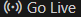

# Project
## A small math web page

f you are looking for a plattform to learn math, you can view this!
This page contains things like:
+ Books
+ Videos
+ Information

Additionally, it has a small guide of topics to learn math:
1. Demostrations
2. Algebra
3. Geometry
4. Calculus

## How to display this page?
There are two ways:
### The easiest 
---
You can go to it clicking on this link: 

[👉 Math Web Page](https://edu.devf.la/en/campus/program/module/intro_programming/final_project/project/module1_final_project)

### The hardest
---
You need the following steps in your computer:
1. Install git
2. Install visual code
3. Install the extension *Live Server*
4. Fork the repository to your github
5. Clone that on your computer with **gitclone**
6. Find the project directory and open it
7. Go to the index file and *Go Live*

    
8. Now,you can navigate through the page,have fun!

